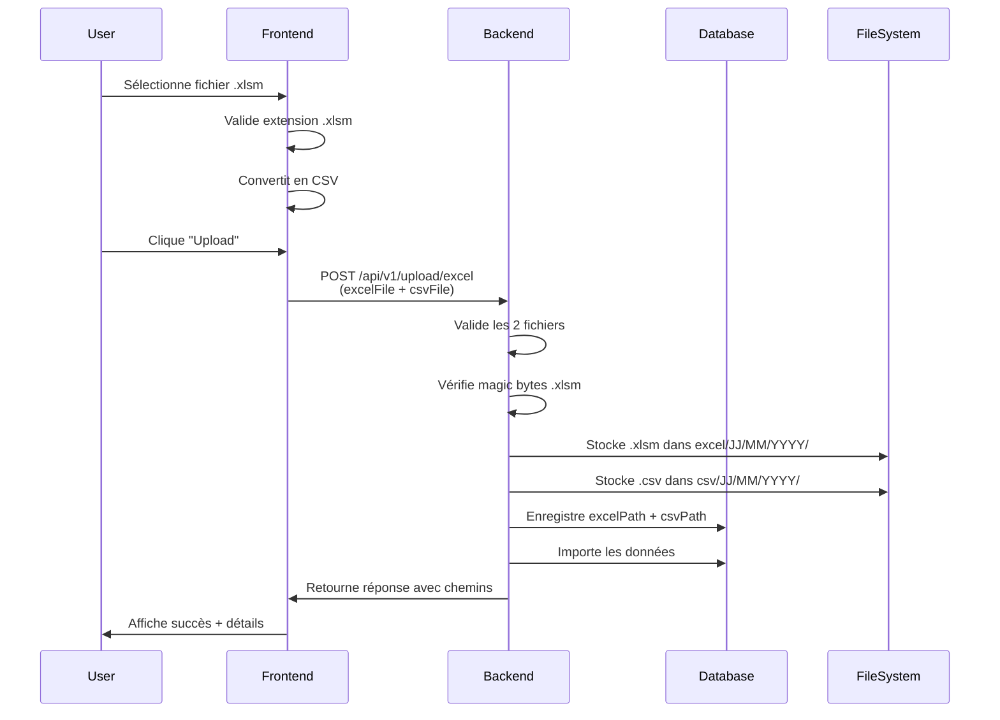

# 📤 GUIDE FRONTEND - Upload Fichiers (Nouvelle Implémentation)

**Date** : 10 octobre 2025  
**Destinataires** : Équipe Frontend (Next.js)  
**Version API** : v1  
**Statut** : ✅ **IMPLÉMENTÉ ET OPÉRATIONNEL**

---

## 🎯 RÉSUMÉ DES CHANGEMENTS

### Ce qui a changé

| Aspect | Ancienne version | ✨ Nouvelle version |
|--------|-----------------|-------------------|
| **Fichiers envoyés** | 1 fichier (Excel OU CSV) | **2 fichiers obligatoires** (Excel .xlsm + CSV) |
| **Type Excel** | .xlsx, .xls, .xlsm | **Uniquement .xlsm** |
| **Stockage** | Racine /uploads | Structure organisée /uploads/{type}/JJ/MM/YYYY/ |
| **Noms fichiers** | Timestamp aléatoire | Noms conviviaux et identifiables |
| **Traçabilité** | Aucune | Chemins enregistrés en base (excelPath, csvPath) |
| **Endpoints** | 1 endpoint | **3 endpoints** (Excel+CSV, CELs, Consolidation) |

### ⚠️ Points critiques

1. **Le frontend DOIT maintenant envoyer 2 fichiers simultanément** :
   - Le fichier Excel original (.xlsm uniquement)
   - Le fichier CSV converti (comme avant)

2. **Validation stricte .xlsm** : Les fichiers .xlsx et .xls sont désormais **REFUSÉS**

3. **FormData modifié** : Nouveaux noms de champs (`excelFile` et `csvFile`)

---

## 📋 SPÉCIFICATIONS TECHNIQUES

### Endpoint Principal : Upload Excel + CSV

#### URL
```
POST /api/v1/upload/excel
```

#### Headers
```http
Authorization: Bearer {access_token}
Content-Type: multipart/form-data
```

#### Body (FormData)

| Champ | Type | Requis | Description | Validation |
|-------|------|--------|-------------|------------|
| `excelFile` | File | ✅ Oui | Fichier Excel original | Extension .xlsm uniquement |
| `csvFile` | File | ✅ Oui | Fichier CSV converti | Extension .csv |
| `codeCellule` | string | ✅ Oui | Code de la cellule | Ex: "CEC_ABOBO_01" |
| `nomFichier` | string | ❌ Non | Nom personnalisé | Ex: "Transmission_Octobre" |
| `nombreBv` | number | ❌ Non | Nombre de bureaux de vote | Ex: 145 |

#### Validations Serveur

✅ **Validations automatiques** :
- Fichier Excel DOIT avoir l'extension .xlsm
- Fichier Excel DOIT être un vrai fichier Excel (magic bytes vérifiés)
- Les 2 fichiers DOIVENT être présents
- Taille maximale : 10MB par fichier
- Code cellule DOIT exister dans la base

❌ **Rejets** :
- Fichier .xlsx → Erreur 400 "Seuls les fichiers .xlsm sont autorisés"
- Fichier .xls → Erreur 400 "Seuls les fichiers .xlsm sont autorisés"
- Fichier CSV manquant → Erreur 400 "Fichier CSV manquant"
- Fichier Excel manquant → Erreur 400 "Fichier Excel (.xlsm) manquant"
- Fichier > 10MB → Erreur 400 "Fichier trop volumineux"

#### Réponse Succès (200/201)

```typescript
{
  "id": "clxy123abc...",
  "codeCellule": "CEC_ABOBO_01",
  "nomFichier": "Transmission_Octobre",
  "statutImport": "COMPLETED",
  "messageErreur": null,
  "dateImport": "2025-10-10T14:30:00.000Z",
  "nombreLignesImportees": 145,
  "nombreLignesEnErreur": 0,
  "excelPath": "excel/10/10/2025/CEL_CEC_ABOBO_01_10-10-2025_14h30_Transmission_Octobre.xlsm",
  "csvPath": "csv/10/10/2025/CEL_CEC_ABOBO_01_10-10-2025_14h30_Transmission_Octobre.csv",
  "details": {
    "headers": ["ORD", "REF LV", "LIB LV", ...],
    "colonnesMappees": {
      "ORD": "ordre",
      "REF LV": "referenceLieuVote",
      ...
    },
    "lignesTraitees": 145,
    "lignesReussies": 145,
    "lignesEchouees": 0
  }
}
```

#### Réponse Erreur (400/401/404/500)

```typescript
// Fichier Excel manquant
{
  "statusCode": 400,
  "message": "Fichier Excel (.xlsm) manquant",
  "error": "Bad Request"
}

// Extension invalide
{
  "statusCode": 400,
  "message": "Seuls les fichiers .xlsm sont autorisés. Les fichiers .xlsx et .xls ne sont pas acceptés.",
  "error": "Bad Request"
}

// Fichier CSV manquant
{
  "statusCode": 400,
  "message": "Fichier CSV manquant",
  "error": "Bad Request"
}

// Validation données
{
  "statusCode": 400,
  "message": "Validation échouée - Erreurs détectées :\n\n• Erreurs de saisie détectées :\n  - Ligne 15 : Colonne 'TAUX PART' : valeur 'ABC' contient des caractères invalides ['A', 'B', 'C']. Corrections suggérées : 'A' → '0', 'B' → '8', 'C' → caractère numérique\n\nVeuillez corriger ces erreurs avant de réessayer l'import.",
  "error": "Bad Request"
}

// CEL non trouvée
{
  "statusCode": 404,
  "message": "CEL non trouvée",
  "error": "Not Found"
}
```

---

## 💻 IMPLÉMENTATION FRONTEND

### React/Next.js - Exemple Complet

```typescript
'use client';

import { useState } from 'react';
import { useAuth } from '@/hooks/useAuth'; // Votre hook d'authentification

interface UploadResponse {
  id: string;
  codeCellule: string;
  nomFichier: string;
  statutImport: 'PENDING' | 'PROCESSING' | 'COMPLETED' | 'ERROR';
  excelPath: string;
  csvPath: string;
  nombreLignesImportees: number;
  nombreLignesEnErreur: number;
}

export default function UploadExcelPage() {
  const { token } = useAuth();
  const [xlsmFile, setXlsmFile] = useState<File | null>(null);
  const [csvFile, setCsvFile] = useState<File | null>(null);
  const [codeCellule, setCodeCellule] = useState('');
  const [loading, setLoading] = useState(false);
  const [error, setError] = useState<string | null>(null);
  const [success, setSuccess] = useState<UploadResponse | null>(null);

  // Validation du fichier .xlsm
  const handleXlsmFileChange = (e: React.ChangeEvent<HTMLInputElement>) => {
    const file = e.target.files?.[0];
    
    if (!file) {
      setXlsmFile(null);
      return;
    }

    // ⚠️ IMPORTANT : Vérifier l'extension .xlsm
    if (!file.name.toLowerCase().endsWith('.xlsm')) {
      setError('Seuls les fichiers .xlsm sont acceptés (pas .xlsx ni .xls)');
      setXlsmFile(null);
      return;
    }

    // Vérifier la taille (10MB max)
    if (file.size > 10 * 1024 * 1024) {
      setError('Fichier Excel trop volumineux (max 10MB)');
      setXlsmFile(null);
      return;
    }

    setXlsmFile(file);
    setError(null);

    // Convertir automatiquement en CSV
    convertXlsmToCsv(file);
  };

  // Conversion Excel → CSV (votre logique existante)
  const convertXlsmToCsv = async (xlsmFile: File) => {
    try {
      // 🔧 Utilisez votre logique de conversion existante
      // Exemple avec xlsx (bibliothèque)
      const XLSX = require('xlsx');
      const reader = new FileReader();
      
      reader.onload = (e) => {
        const data = e.target?.result;
        const workbook = XLSX.read(data, { type: 'binary' });
        const sheetName = workbook.SheetNames[0];
        const worksheet = workbook.Sheets[sheetName];
        
        // Convertir en CSV
        const csv = XLSX.utils.sheet_to_csv(worksheet, { FS: ';' });
        
        // Créer un fichier CSV
        const csvBlob = new Blob([csv], { type: 'text/csv' });
        const csvFile = new File([csvBlob], xlsmFile.name.replace('.xlsm', '.csv'), {
          type: 'text/csv'
        });
        
        setCsvFile(csvFile);
      };
      
      reader.readAsBinaryString(xlsmFile);
    } catch (error) {
      console.error('Erreur conversion CSV:', error);
      setError('Erreur lors de la conversion du fichier en CSV');
    }
  };

  // Upload vers le backend
  const handleUpload = async () => {
    // Validation
    if (!xlsmFile) {
      setError('Veuillez sélectionner un fichier .xlsm');
      return;
    }

    if (!csvFile) {
      setError('Le fichier CSV n\'a pas été généré');
      return;
    }

    if (!codeCellule) {
      setError('Veuillez sélectionner une cellule');
      return;
    }

    setLoading(true);
    setError(null);
    setSuccess(null);

    try {
      // Préparer FormData avec les 2 fichiers
      const formData = new FormData();
      formData.append('excelFile', xlsmFile); // ⚠️ Nom important : excelFile
      formData.append('csvFile', csvFile);     // ⚠️ Nom important : csvFile
      formData.append('codeCellule', codeCellule);
      formData.append('nomFichier', xlsmFile.name.replace('.xlsm', ''));
      
      // Optionnel : nombre de bureaux de vote
      // formData.append('nombreBv', '145');

      // Envoyer au backend
      const response = await fetch('http://localhost:3001/api/v1/upload/excel', {
        method: 'POST',
        headers: {
          'Authorization': `Bearer ${token}`,
          // ⚠️ NE PAS mettre 'Content-Type': FormData le fait automatiquement
        },
        body: formData,
      });

      if (!response.ok) {
        const errorData = await response.json();
        throw new Error(errorData.message || 'Erreur lors de l\'upload');
      }

      const result: UploadResponse = await response.json();
      setSuccess(result);
      
      // Réinitialiser le formulaire
      setXlsmFile(null);
      setCsvFile(null);
      setCodeCellule('');
      
    } catch (err) {
      setError(err instanceof Error ? err.message : 'Erreur inconnue');
    } finally {
      setLoading(false);
    }
  };

  return (
    <div className="upload-container">
      <h1>Upload Fichier Excel (.xlsm)</h1>

      {/* Sélection fichier Excel */}
      <div className="form-group">
        <label>Fichier Excel (.xlsm) *</label>
        <input
          type="file"
          accept=".xlsm"
          onChange={handleXlsmFileChange}
          disabled={loading}
        />
        {xlsmFile && (
          <p className="file-info">
            ✅ {xlsmFile.name} ({(xlsmFile.size / 1024).toFixed(2)} KB)
          </p>
        )}
      </div>

      {/* Fichier CSV généré automatiquement */}
      {csvFile && (
        <div className="form-group">
          <label>Fichier CSV (généré automatiquement)</label>
          <p className="file-info">
            ✅ {csvFile.name} ({(csvFile.size / 1024).toFixed(2)} KB)
          </p>
        </div>
      )}

      {/* Code cellule */}
      <div className="form-group">
        <label>Code Cellule *</label>
        <input
          type="text"
          value={codeCellule}
          onChange={(e) => setCodeCellule(e.target.value)}
          placeholder="Ex: CEC_ABOBO_01"
          disabled={loading}
        />
      </div>

      {/* Bouton upload */}
      <button
        onClick={handleUpload}
        disabled={loading || !xlsmFile || !csvFile || !codeCellule}
      >
        {loading ? 'Upload en cours...' : 'Uploader'}
      </button>

      {/* Affichage erreurs */}
      {error && (
        <div className="error-message">
          ❌ {error}
        </div>
      )}

      {/* Affichage succès */}
      {success && (
        <div className="success-message">
          <h3>✅ Upload réussi !</h3>
          <p>Code CEL : {success.codeCellule}</p>
          <p>Lignes importées : {success.nombreLignesImportees}</p>
          <p>Statut : {success.statutImport}</p>
          <details>
            <summary>Détails des fichiers</summary>
            <p>Excel : {success.excelPath}</p>
            <p>CSV : {success.csvPath}</p>
          </details>
        </div>
      )}
    </div>
  );
}
```

### TypeScript - Types

```typescript
// types/upload.ts

export enum ImportStatus {
  PENDING = 'PENDING',
  PROCESSING = 'PROCESSING',
  COMPLETED = 'COMPLETED',
  ERROR = 'ERROR'
}

export interface UploadExcelRequest {
  excelFile: File;    // Fichier .xlsm
  csvFile: File;      // Fichier .csv
  codeCellule: string;
  nomFichier?: string;
  nombreBv?: number;
}

export interface UploadExcelResponse {
  id: string;
  codeCellule: string;
  nomFichier: string;
  statutImport: ImportStatus;
  messageErreur?: string;
  dateImport: string;
  nombreLignesImportees: number;
  nombreLignesEnErreur: number;
  excelPath: string;  // ✨ Nouveau
  csvPath: string;    // ✨ Nouveau
  details: {
    headers: string[];
    colonnesMappees: Record<string, string>;
    lignesTraitees: number;
    lignesReussies: number;
    lignesEchouees: number;
  };
}

export interface UploadError {
  statusCode: number;
  message: string;
  error: string;
}
```

### Service API

```typescript
// services/uploadService.ts

import { UploadExcelRequest, UploadExcelResponse } from '@/types/upload';

export class UploadService {
  private baseUrl = process.env.NEXT_PUBLIC_API_URL || 'http://localhost:3001';
  
  async uploadExcelAndCsv(
    request: UploadExcelRequest,
    token: string
  ): Promise<UploadExcelResponse> {
    const formData = new FormData();
    
    // ⚠️ Noms de champs importants
    formData.append('excelFile', request.excelFile);
    formData.append('csvFile', request.csvFile);
    formData.append('codeCellule', request.codeCellule);
    
    if (request.nomFichier) {
      formData.append('nomFichier', request.nomFichier);
    }
    
    if (request.nombreBv) {
      formData.append('nombreBv', request.nombreBv.toString());
    }

    const response = await fetch(`${this.baseUrl}/api/v1/upload/excel`, {
      method: 'POST',
      headers: {
        'Authorization': `Bearer ${token}`,
      },
      body: formData,
    });

    if (!response.ok) {
      const error = await response.json();
      throw new Error(error.message || 'Erreur lors de l\'upload');
    }

    return response.json();
  }
}
```

---

## 🎨 NOUVEAUX ENDPOINTS DISPONIBLES

### 1. Upload CEL Signé (PDF, Image)

```typescript
POST /api/v1/upload/cels
```

**Body (FormData)** :
```typescript
{
  file: File,        // PDF, JPG, PNG (max 10MB)
  celCode: string,   // Ex: "CEC_ABOBO_01"
  celId: string      // Ex: "cel-123"
}
```

**Réponse** :
```typescript
{
  success: true,
  fileId: "cel-123",
  filePath: "cels/CEC_ABOBO_01/10/10/2025/CEL_SIGNE_CEC_ABOBO_01_10-10-2025_14h30.pdf",
  fileName: "cel_signe.pdf",
  fileSize: 125680,
  message: "Fichier CEL uploadé avec succès"
}
```

### 2. Upload Consolidation

```typescript
POST /api/v1/upload/consolidation
```

**Body (FormData)** :
```typescript
{
  file: File,         // Excel, PDF, CSV (max 10MB)
  reference: string,  // Ex: "DEPT_001"
  type?: string       // Ex: "DEPARTEMENT"
}
```

**Réponse** :
```typescript
{
  success: true,
  filePath: "consolidation/10/10/2025/CONSOLIDATION_DEPARTEMENT_DEPT_001_10-10-2025_14h30.xlsx",
  fileName: "consolidation.xlsx",
  fileSize: 245680,
  reference: "DEPT_001",
  type: "DEPARTEMENT",
  message: "Fichier de consolidation uploadé avec succès"
}
```

---

## ✅ CHECKLIST DE MIGRATION FRONTEND

### Phase 1 : Préparation

- [ ] Lire et comprendre ce guide
- [ ] Vérifier que le backend est déployé et opérationnel
- [ ] Obtenir l'URL du backend (`http://localhost:3001` en dev)
- [ ] Vérifier que vous avez un token d'authentification valide

### Phase 2 : Modifications Code

- [ ] Modifier le composant d'upload pour accepter uniquement `.xlsm`
- [ ] Ajouter la génération automatique du CSV
- [ ] Modifier le FormData pour envoyer 2 fichiers (`excelFile` et `csvFile`)
- [ ] Mettre à jour les types TypeScript
- [ ] Gérer les nouvelles réponses (avec `excelPath` et `csvPath`)
- [ ] Gérer les nouveaux messages d'erreur

### Phase 3 : Tests

- [ ] Tester upload avec fichier `.xlsm` valide
- [ ] Vérifier que `.xlsx` est bien rejeté
- [ ] Vérifier que `.xls` est bien rejeté
- [ ] Tester upload sans fichier CSV
- [ ] Tester upload sans fichier Excel
- [ ] Tester upload fichier > 10MB
- [ ] Vérifier l'affichage des chemins de fichiers
- [ ] Tester la gestion d'erreur complète

### Phase 4 : Validation

- [ ] Tester en environnement de développement
- [ ] Tester avec plusieurs CELs différentes
- [ ] Vérifier les données en base de données
- [ ] Valider avec l'équipe backend

---

## 🔧 CONFIGURATION

### Variables d'environnement

```env
# .env.local
NEXT_PUBLIC_API_URL=http://localhost:3001
```

### CORS

Le backend accepte les origines suivantes (configurables) :
- `http://localhost:3000`
- `http://localhost:3001`
- Autres origines configurées dans `CORS_ORIGINS`

---

## ❓ FAQ

### Q1 : Pourquoi envoyer 2 fichiers maintenant ?

**R :** Pour assurer la traçabilité et l'archivage. Le fichier Excel original (.xlsm) est conservé pour référence légale, tandis que le CSV est utilisé pour le traitement.

### Q2 : Pourquoi uniquement .xlsm et pas .xlsx ?

**R :** Pour des raisons de sécurité et de standardisation. Le format .xlsm est celui utilisé par le système de transmission officiel.

### Q3 : Que faire si la conversion CSV échoue ?

**R :** Affichez une erreur claire à l'utilisateur et ne permettez pas l'upload. Le fichier CSV est obligatoire.

### Q4 : Les chemins `excelPath` et `csvPath` servent à quoi ?

**R :** Ils permettent de retrouver les fichiers originaux en cas de besoin (audit, vérification, re-traitement).

### Q5 : L'ancien endpoint fonctionne-t-il encore ?

**R :** Oui, l'endpoint existe toujours mais avec la nouvelle logique. Il faut maintenant envoyer 2 fichiers au lieu d'un seul.

### Q6 : Comment gérer les fichiers volumineux ?

**R :** La limite est fixée à 10MB par fichier. Si nécessaire, demandez à l'utilisateur de compresser ou de diviser les données.

---

## 🆘 SUPPORT

### En cas de problème

1. **Erreur 400** : Vérifiez que vous envoyez bien les 2 fichiers avec les bons noms
2. **Erreur 401** : Vérifiez votre token d'authentification
3. **Erreur 404** : Vérifiez que le code CEL existe dans la base
4. **Erreur 413** : Fichier trop volumineux (max 10MB par fichier)
5. **Erreur 500** : Contactez l'équipe backend

### Contacts

- **Équipe Backend** : backend@ceibureau.ci
- **Documentation** : `docs/GUIDE_BACKEND_STOCKAGE_FICHIERS.md`

---

## 📊 EXEMPLE DE FLUX COMPLET



---

**Version** : 1.0  
**Date de création** : 10 octobre 2025  
**Dernière mise à jour** : 10 octobre 2025  
**Auteur** : Équipe Backend NestJS

